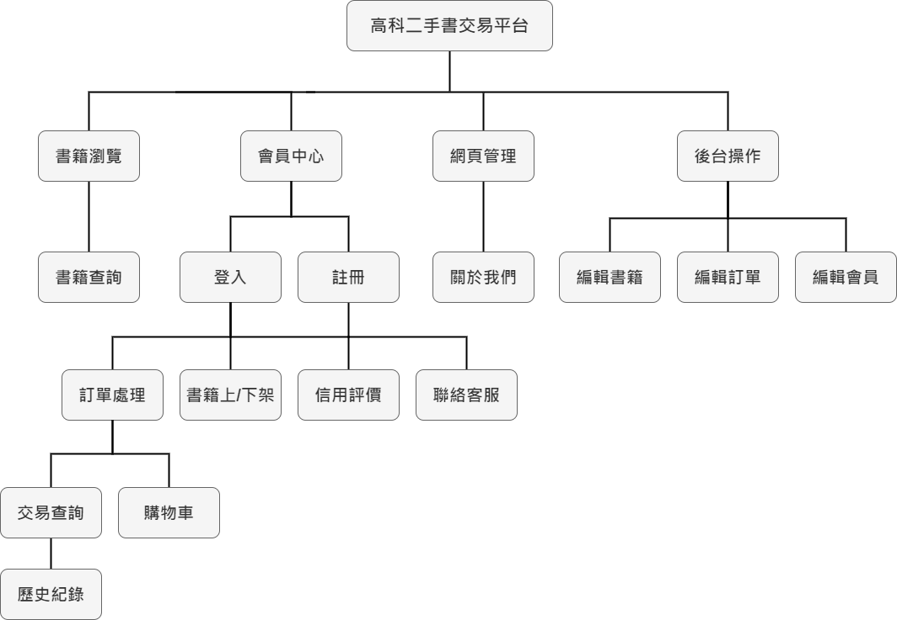
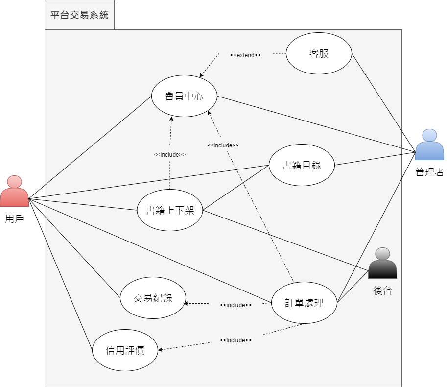
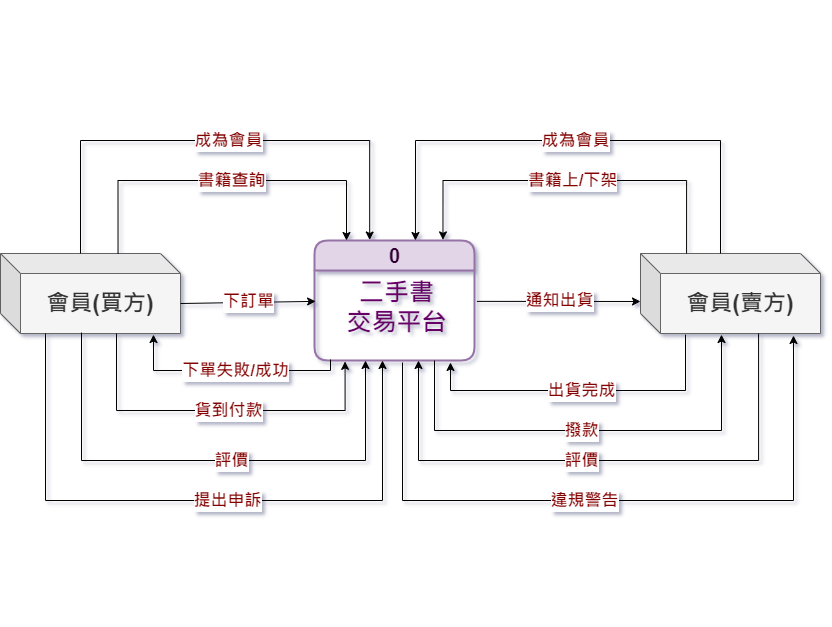
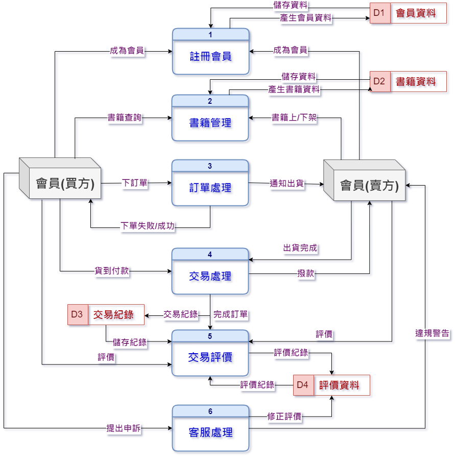
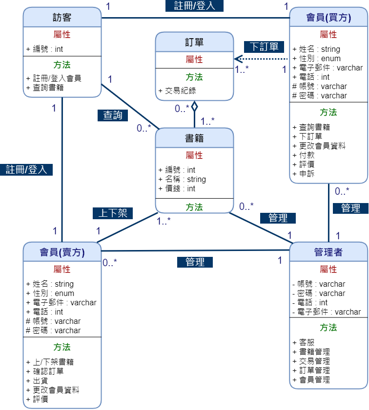
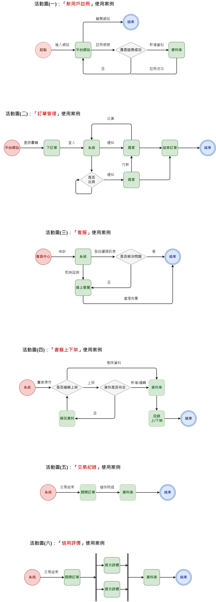
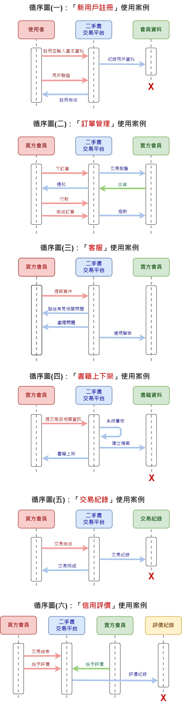

# Team3
# 出了一點意外，補救中 Q_Q

## 主題 : 高科二手書交易平台

## 內容
　　因為學校教學使用之教科書價格大多十分昂貴，加上很多課程都只佔一學期，很多同學買了新書卻只使用半年不到就再也沒有翻開過，因此便有了FB二手社團供同學們買賣各種需要的書籍。但我們還是發現其中的不便性，尤其是沒有一個制式的發文格式規範，導致難以查詢自己需要的書籍，價格也不明朗，以及社團內龍蛇混雜，有時候談好了後來人卻消失了，也不知道對方是誰無從查找。

　　因此我們想要開發一個交易平台，讓高科大的學生們能夠更方便的交易自己需要/不需要的書籍，達到買賣雙方皆能獲得好處，同時達成不浪費書籍資源的三贏局面。

## 組員
||學號|姓名|任務分配|
|-|---|----|--------|
||C108118103|廖宇筌|主題討論、資料蒐集、架構規劃、系統測試|
|組長|C108118107|蔡淑安|主題討論、資料蒐集、介面設計、系統測試|
||C108118109|賴佩瑜|主題討論、資料蒐集、架構規劃、系統測試|
||C108118113|蔡欣娪|主題討論、資料蒐集、系統設計、系統測試|
||C108118114|蔡青樺|主題討論、資料蒐集、介面設計、系統測試|
||C108118117|朱彩琪|主題討論、資料蒐集、系統設計、系統測試|

---

## 甘特圖

## PERT/CPM圖

---

## 功能性需求 : 
+ 書籍管理：書籍的上下架，以及根據查詢條件來顯示結果。
+ 訂單管理：訂購書籍，查詢、紀錄交易明細。
+ 用戶管理：會員資料審核及認證等。

## 非功能性需求 :
- 相容性：支援各種作業系統。
- 實名認證：嚴格審查，提高安全性。
- 圖形化介面（UI）：淺顯易懂的操作模式。

## 功能分解圖(FDD)

## 高科二手書交易平台的需求分析：

1. 管理者可以編輯會員資料、書籍目錄及訂單資料。
2. 用戶可透過分類快速查詢書籍。
3. 用戶可透過註冊登入會員來上下架書籍、訂購書籍。
4. 交易紀錄透明化，保留歷史紀錄。
5. 用戶可透過查詢交易紀錄，作為價格參考。
6. 用戶可查看賣家/買家的信用紀錄，避免後續糾紛浪費時間。
7. 會員可透過客服投訴信用不良者或其他問題，藉以實施懲處停權。

---

## 使用案例圖

## 使用案例說明

|使用案例名稱|會員中心|
|:---|:---|
|行動者|用戶|
|說明|新用戶|
|完成動作|1.用戶點擊註冊並輸入基本資料 2.資料庫紀錄用戶資料 3.系統畫面顯示註冊完成|
|替代方案|1.用戶點擊註冊並輸入基本資料 2.資料庫紀錄有誤 3.系統畫面顯示註冊失敗|
|先決條件|進入註冊頁面|
|後置條件|註冊完成，可以登入使用其他功能|
|假設|無|

|使用案例名稱|訂單管理|
|:---|:---|
|行動者|用戶|
|說明|會員訂購書籍過程|
|完成動作|1.對目標書籍點選訂購 2.系統審核後通知賣方進行交易手續 3.待雙方確認完成交易 4.結束訂單|
|替代方案|1.對目標書籍點選訂購 2.系統審核後通知賣方進行交易手續 3.其中一方取消交易 4.結束訂單|
|先決條件|用戶必須先登入會員|
|後置條件|結束訂單後商品自動下架，雙方需互相給評，同時系統會記錄交易事項|
|假設|無|

## DFD-系統環境圖

## DFD-圖0

## 類別圖

## 活動圖

## 循序圖

